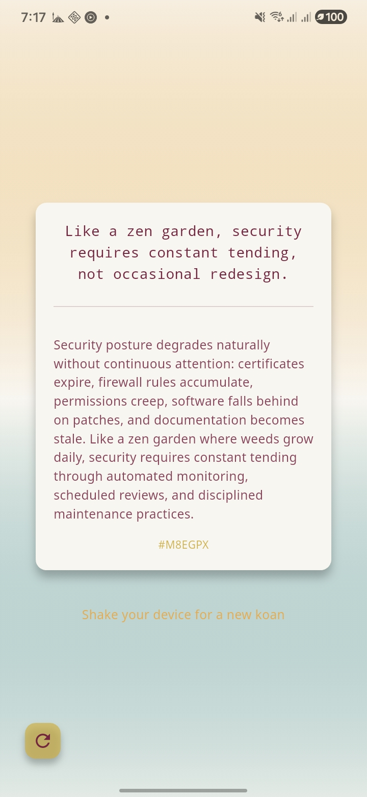
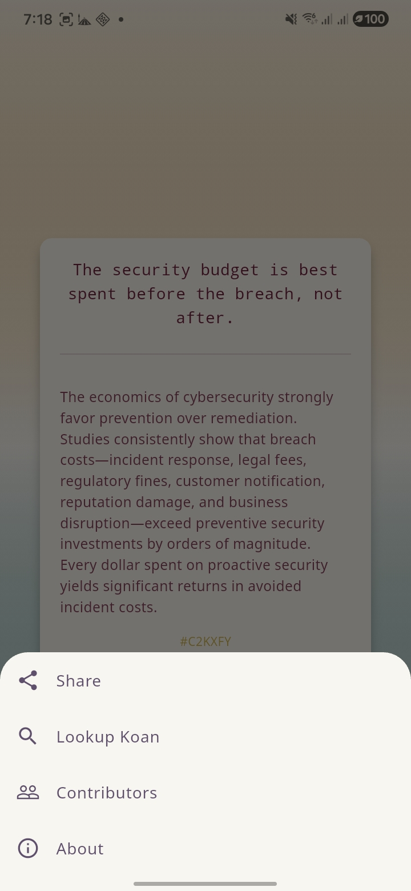
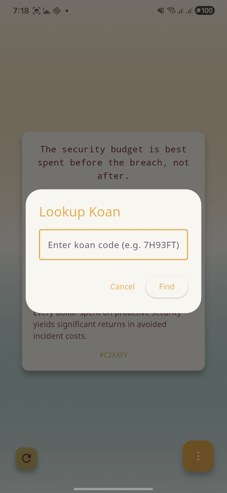

# Cybersecurity Zen Koans 🧘‍♂️🔐

<p align="center">
  
</p>

**Cybersecurity Zen Koans** is an open-source cross-platform mobile app built with [Flutter](https://flutter.dev). It blends ancient Zen wisdom with modern cybersecurity principles in the form of short, thought-provoking koans. The app is designed to encourage mindfulness while deepening awareness of secure digital practices.

> Created by **ktech Students** 🎓

---

## 📸 Screenshots

<p align="center">
  
  
  
</p>

---

## ✨ Features

- 🧘 217 unique cybersecurity-themed Zen koans with technical explanations
- 📱 Cross-platform — runs on both Android and iOS
- 🎨 Built with Flutter and Material Design 3
- 🌙 Clean and minimalist UI with dark mode support
- 📤 Share koans as screenshots
- 🫨 Shake your device to discover a new koan
- 🛡️ Koans focused on digital awareness and ethical behavior

---

## 🛠️ Tech Stack

- Flutter 3.35+
- Dart 3.9+
- Material Design 3
- Google Fonts (Noto Sans)
- share_plus, sensors_plus, screenshot, url_launcher

---

## 🧩 Open Source

This project is proudly open-source under the MIT License. Contributions, suggestions, and pull requests are welcome!

---

## 🚀 Getting Started

The Flutter project lives in the `src/` directory.

### Prerequisites

- Flutter SDK 3.35+
- Android SDK (for Android builds)
- Xcode (for iOS builds)
- Git

### Steps

1. **Clone the Repository**
   ```bash
   git clone https://github.com/KuwaitDevs/cybersecurity_zen_koans_app.git
   cd cybersecurity_zen_koans_app/src
   ```

2. **Install Dependencies**
   ```bash
   flutter pub get
   ```

3. **Run on Android**
   ```bash
   flutter run
   ```

4. **Run on iOS**
   ```bash
   flutter run --device-id <ios-device-or-simulator>
   ```

5. **Build for Production**
   ```bash
   # Android APK
   flutter build apk --release

   # Android App Bundle
   flutter build appbundle --release

   # iOS
   flutter build ios --release
   ```

---

## 📄 License

This project is licensed under the MIT License - see the [LICENSE](LICENSE) file for details.

---

## 🤝 Contributing

Want to help? Contributions are more than welcome! Check out the [CONTRIBUTING.md](CONTRIBUTING.md) for guidelines.

---

## 💬 Contact

For questions or ideas, feel free to open an issue or reach out via GitHub Discussions.

---

## 🧘‍♀️ May your mind be clear, and your passwords complex.
